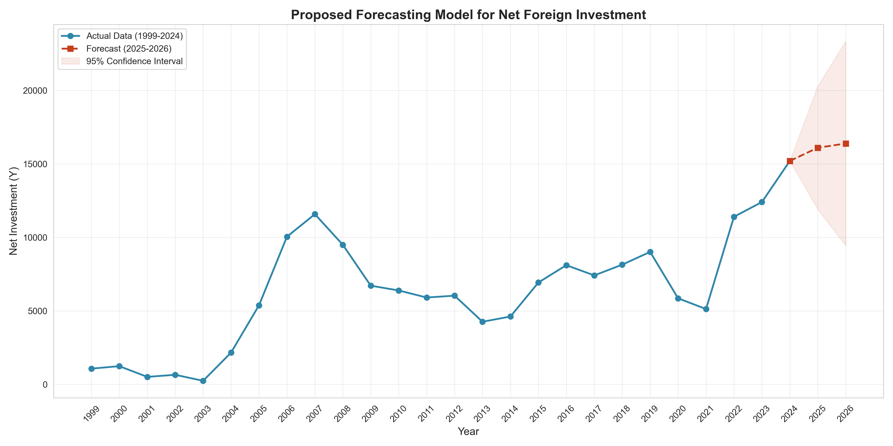
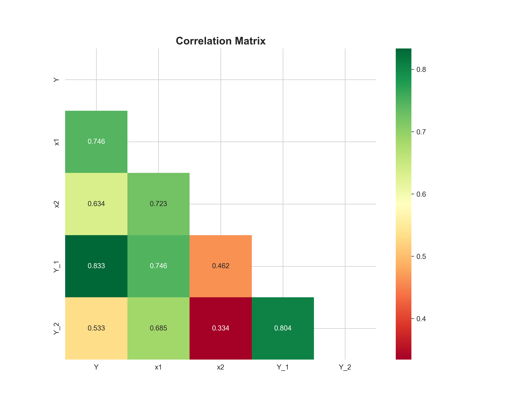

# 📈 Proposed Statistical Model for Forecasting Net Foreign Direct Investment (FDI) in Egypt (1999-2026)

This repository contains a comprehensive statistical study and a forecasting model developed to predict Net Foreign Direct Investment (FDI) in Egypt. The project integrates traditional econometric methods with advanced time-series analysis.

## 🎓 Academic Context
* **Institution:** Cairo University - Faculty of Graduate Studies for Statistical Research (FGSSR).
* **Project Title:** نموذج إحصائي مقترح للتنبؤ بصافي الاستثمارات الأجنبية.
* **Supervised by:** Dr. Salah Mahdy.

## 📁 Repository Content
The project includes the following core files:
- **`data-time series.sav`**: Original dataset in SPSS format.
- **`data-time series.ipynb`**: Complete Python implementation (Data Cleaning, Analysis, and Modeling).
- **`investment_forecast.png`**: The final forecasting visualization for 2025-2026.
- **`acf_pacf.png`**: Diagnostic plots for time-series stationarity and model order.
- **Visual Assets**: Includes correlation matrices, distribution histograms, and boxplots.

## 🛠️ Tech Stack & Methodology
- **Languages/Tools:** Python (Jupyter Notebook), SPSS.
- **Libraries:** `pandas`, `statsmodels`, `seaborn`, `scipy`, `matplotlib`.
- **Methodologies:** - **Descriptive Statistics:** To understand data central tendencies and variance.
  - **Multiple Linear Regression (OLS):** To analyze the impact of independent variables ($x_1, x_2$).
  - **ARIMA (Box-Jenkins):** To capture the temporal dynamics of the investment series.

## 📊 Key Insights
- **Normality:** Verified using the Shapiro-Wilk test ($P > 0.05$ for the dependent variable $Y$).
- **Correlation:** Identified a strong positive correlation ($r = 0.833$) between current FDI and its previous year's value.
- **Forecasting:** The proposed **ARIMA(1,1,0)** model effectively predicts the investment trend for the upcoming years (2025-2026) with calculated confidence intervals.

## 🖼️ Visual Highlights
### Time Series Forecast (2025-2026)


### Correlation Matrix


## 🚀 How to Run
1. Clone the repository:
   ```bash
   git clone [https://github.com/mohamed2nabil/Forecasting-Net-Foreign-Direct-Investment-FDI-in-Egypt-1999-2026-](https://github.com/mohamed2nabil/Forecasting-Net-Foreign-Direct-Investment-FDI-in-Egypt-1999-2026-)
